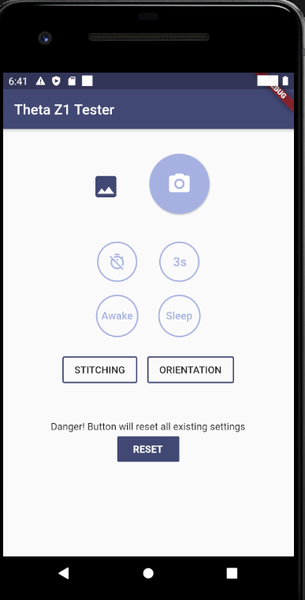
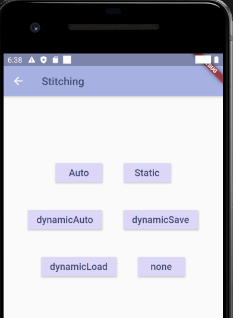

# Caitlyn's Ricoh Theta Z1 Tester

This is a simple app to test the Z1 functionality. 

The app was tested on BOTH android and iOS physical devices. On android it was tested on Google Pixel 2 running android 10. For iOS it was tested on iPhone 7.

It has these features.

## App Features

* Take Picture Button
* Disable Timer Button
* Set Timer (3 seconds) Button
* Disable Sleep Button
* Set Sleep (every 180 seconds) Button
* RESET button
* Automatic stitching - `auto`
* Disable stitching and take dual fish-eye image - `none`

## Image Stitching

This is a photo of a dual fish-eye image. I disabled the stitching with a button and took the photo. 

  * Static stitching - `static`
  * Dynamic stitching - `dynamicAuto`
  * Dynamic stitching and save - `dynamicSave`
  * Dynamic Stitching and load - `dyanmicLoad`

  API:  [_imageStitching](https://api.ricoh/docs/theta-web-api-v2.1/options/_image_stitching/)

## Orientation and Top/Bottom Correction

  * Enable top/bottom correction for ALL images -  `Apply`
  * For multiple interval shots, use correction from FIRST shot only - `ApplyAuto`
  * Performs top/bottom correction & saves parameters - `ApplySave`
  * Performs top/bottom correction using saved parameters - `ApplyLoad`
  * Disable top/bottom correction - `Disapply`

For Normal shooting, performs dynamic stitching, for Interval shooting, saves dynamic distortion correction parameters for the first image and then uses them for the 2nd and subsequent images

API [_topBottomCorrection](https://api.ricoh/docs/theta-web-api-v2.1/options/_top_bottom_correction/)

## Testing on Physical Devices

### Android Google Pixel 2

## Screen Details

This is my temporary view of the stitching screen. 

Temporary orientation screen.

## To Do

* improve buttons and UI interface
* make reset screen
* view image on mobile phone
